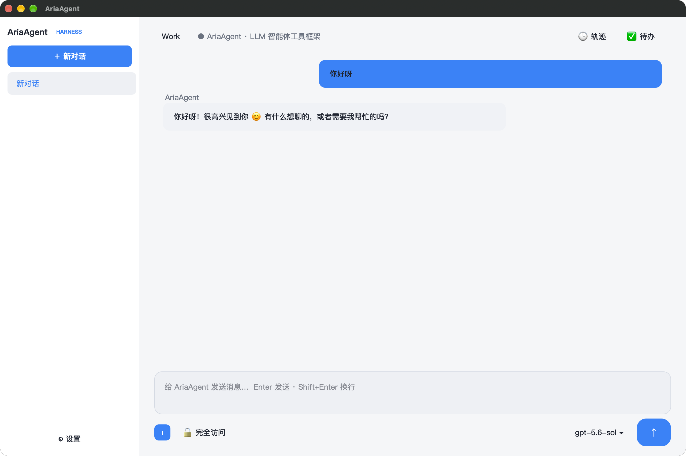
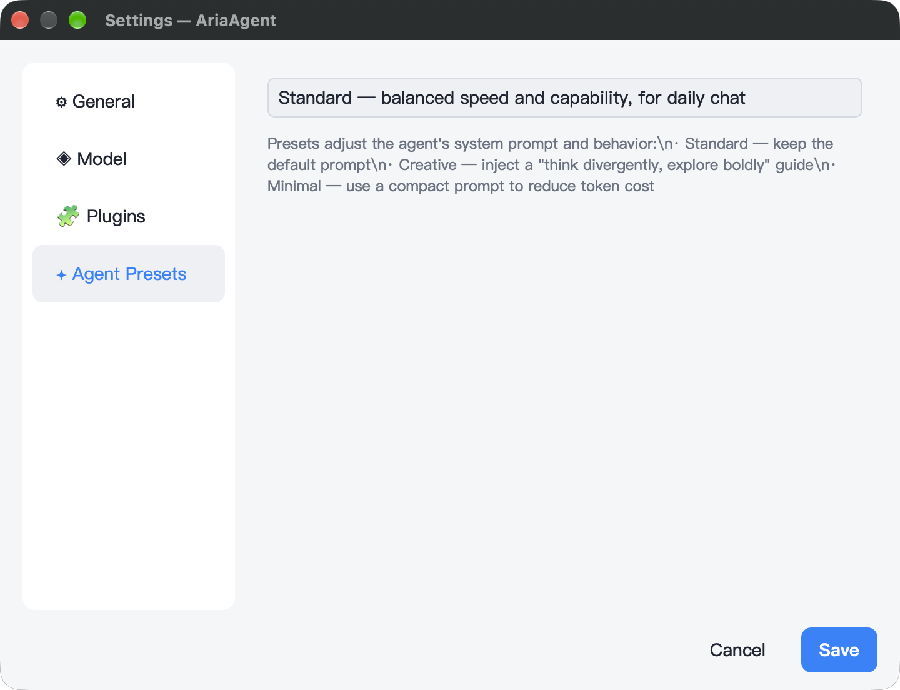

<div align="center">

# ✦ AriaAgent

[Complete dependency update guide](docs/dependency-updates.en.md) — Version pins, selective updates, offline use, rollback and commit steps.

Current version **0.2.0** · Aria **3.1.1**

**Industrial-grade C++23 Agent Tooling Framework GUI** · Built on [Aria](https://github.com/dqsjqian/Aria) (C++23 MVVM)

Provider-agnostic · True token-level SSE streaming · Tool-call chain visualization · Permission approval · MIT License

[](https://en.cppreference.com/w/cpp/23)
[](https://www.qt.io)
[](LICENSE)
[](https://github.com/dqsjqian/Aria)

[English](README.en.md) | [简体中文](README.md)

</div>

---

## What is it?

**AriaAgent** is a **provider-agnostic LLM Agent tooling framework GUI** built on
[Aria](https://github.com/dqsjqian/Aria), an industrial-grade C++23 MVVM framework.

It is not tied to any single model vendor — every **OpenAI-compatible endpoint**
(DeepSeek / OpenAI / Kimi / Qwen / GLM / …) works out of the box. Switching
providers is a one-line configuration change: no code edits, no recompile.

The agent loop (think → call tools → observe → repeat) is written with C++23
coroutines, and the UI layer is fully decoupled from the engine through Aria's
reactive core (`Property` / `ObservableList`). The overall design borrows the
architectural essence of the official DeepSeek harness: event log as the single
source of truth, schema-driven tools, and fail-closed permissions.

## ✨ Features

### 🧠 Agent Core
- **Provider-agnostic** — abstract `LlmClient` interface + `OpenAiCompatClient`
  implementation; any OpenAI-compatible API plugs in seamlessly
- **True streaming** — token-level SSE rendering (Mira's
  chunked body reads), not buffered fake streaming
- **Agent loop** — coroutine think/tool/observe loop with **bounded parallel**
  tool execution (exclusive barrier + parallel pool, results committed in model
  order) and a hard round cap to prevent runaway
- **Tool registry** — plug-and-play: `Tool{name, desc, schema, fn}`, no
  hardcoded branches
- **Arg validation** — lightweight JSON-Schema validator (type/required/enum/
  range) with path-qualified error messages

### 🛠 Built-in tools (10+)
| Tool | Description | Permission |
|---|---|---|
| `calculator` | Arithmetic / power | No approval |
| `current_time` | Current local time | No approval |
| `run_command` | Synchronous shell exec (with timeout) | **Approval** |
| `run_in_background` / `read_output` / `kill_process` | Background process handle + incremental polling | **Approval** |
| `read_file` / `write_file` / `edit_file` | File read/write/edit (path-traversal guarded) | **Write = Approval** |
| `list_directory` | Directory listing | No approval |
| `todo_set` / `todo_add` / `todo_list` | Agent-visible todos (snapshot last-wins) | No approval |

### 🗂 Session & UI
- **Multi-session** — sidebar session list (create / switch / right-click delete),
  JSON persistence to `~/.ariaagent/sessions/`, auto-restore on launch
- **Multi-turn context** — the engine owns the full message history; the agent
  has memory
- **Auto-compaction** — summarizes old turns past 32 messages without splitting
  tool-call/result pairs
- **Markdown rendering** — in-bubble Markdown + 4-color syntax highlighting
- **Trajectory panel** — right-side tool-call timeline (success/failure colors)
- **Todo panel** — live projection of the agent's todo list
- **Message feedback** — right-click 👍/👎, persisted
- **Approval gate** — modal confirmation before dangerous tools, default-deny
  (fail-closed)

### 🏗 Architecture (pure-C++ core + platform shells)
```
AriaAgent/
├── core/                    # ★ Pure C++, zero Qt (reused verbatim on mobile)
│   ├── agent/               #   engine: agent loop / llm_client / tools /
│   │                        #   session_store / json_schema / subprocess
│   └── module_api/          #   BaseVm / IModule / ModuleRegistry / ServiceHub
├── modules/                 # ★ feature modules (plugin pattern, VM per module)
│   ├── chat/                #   chat module (engine bridge + ChatViewModel)
│   ├── sessions/            #   session list (sidebar projection)
│   ├── settings/            #   settings + Qt settings dialog
│   ├── todo/  trajectory/   #   todos / tool-call trajectory
│   └── app/                 #   app shell
│       ├── viewmodel/       #   AppText (UI string service)
│       └── platforms/qt/    #   ★ Shell: main.cpp (QtDispatcher) /
│                            #     main_window / markdown_render
├── build/deps/aria          # pinned Aria fetch (scripts/ci/fetch_aria.py)
├── core/CMakeLists.txt      # ariaagent_core
└── modules/app/platforms/qt/CMakeLists.txt  # aria_agent executable
```

> Note: the legacy `platform/` directory is dead code; the real Qt shell lives
> in `modules/app/platforms/qt/` (see the top-level CMakeLists.txt). Future
> iOS/Android shells will live under `modules/app/platforms/` and link the same
> core verbatim.
**Threading**: the VM marshals back to the UI thread via
`aria::runtime::main_dispatcher()` — the Qt shell installs a `QtDispatcher`,
mobile shells install their own; the VM never knows which platform it is on.

**Approval prompts**: the VM exposes an `approval_ui` callback that the shell
injects (QMessageBox / UIAlertController / Android Dialog). The VM never pops
a dialog itself.

## 🖼 Screenshots

AriaAgent is built on the Aria C++23 MVVM framework plus the Qt6 adapter. Both
core views below come from the macOS build and are driven entirely by Aria's
reactive engine (`Property` / `ObservableList` / `Command`).

| View | Screenshot |
|---|---|
| Main chat (streaming + tool-call timeline) |  |
| Settings (General / Model / Plugins / Agent Presets) |  |

> **Why no Windows / Linux screenshots?** The macOS shell is built on **the Aria
> framework + the Qt6 adapter**; the Windows and Linux builds look identical to
> the macOS one (same Qt widgets + the same C++ ViewModel), so duplicate
> screenshots would add nothing. Windows additionally has two independently
> validated toolchains — MSVC + Qt6 and MSYS2 UCRT64.

## 🚀 Quick start

### Prerequisites
- **Windows UCRT64**: MSYS2 UCRT64 (GCC 14+), Qt6, CMake ≥ 3.21, and the MSYS `make` and `perl` packages (`pacman -S make perl`) for the source OpenSSL build.
- **Windows MSVC**: run CMake in an x64 Developer PowerShell with `cl`, `nmake`, Perl, and NASM on `PATH`. Selecting a Visual Studio generator does not initialize the developer environment for the external OpenSSL build.
- **macOS**: Xcode CommandLineTools, Qt6 (`brew install qt`), CMake ≥ 3.21
- **All platforms**: a C++23 compiler, Git, and Python 3.10+.
- Resolve and verify Aria before configuring CMake manually:

```bash
python scripts/ci/fetch_aria.py
```

The single root `dependencies.json` contains version requests and each dependency’s `resolved` result. Without an explicit version or a matching lock, the first resolution selects the latest stable release and records its version, commit, and SHA256. Existing locks are reused, so ordinary builds do not follow new releases. Explicit versions take priority: for example, `python scripts/ci/fetch_aria.py --version 3.1.1` overrides `ARIA_DEP_ARIA_VERSION`. Run `python scripts/ci/fetch_aria.py --update` to upgrade Aria deliberately.

Override C++ libraries with options such as `-DARIA_DEP_JSON_VERSION=3.12.0`, `-DARIA_DEP_MIRA_VERSION=1.0.0`, and `-DARIA_DEP_OPENSSL_VERSION=4.0.3`. CMake records temporary overrides in a build-directory resolution cache without changing the source `dependencies.json`. To update the shared library lock, run `python scripts/ci/update_dependencies.py`, review the changes, and commit this dependency file. Explicit source overrides and dependency targets supplied by a parent project retain priority.

Qt uses installed SDKs and never downloads or installs them automatically. The default prefers the latest discoverable version; `-DARIA_DEP_QT_VERSION=6.8.3` requires that exact version. Use `Qt6_DIR` / `CMAKE_PREFIX_PATH` to select an SDK location.

A local repository can supply the exact Aria commit selected by the lock:

```bash
python scripts/ci/fetch_aria.py --source /path/to/Aria
# The build runners accept the same source through the environment
ARIA_SOURCE=/path/to/Aria ./scripts/build.sh
```

On Windows, set `$env:ARIA_SOURCE = "C:\path\to\Aria"`. `--source` overrides `ARIA_SOURCE`; the default source is GitHub. Both build runners verify the actual Git HEAD on every build. Local edits block replacement, successful updates preserve the old checkout under `build/deps/aria-backup-*`, and failed fetches leave the current checkout intact.

### Portable Python entry

`python scripts/build.py --test` reuses the locked dependency fetcher, configures
CMake, builds and runs host tests. `--dry-run` is read-only; `--offline` forbids
dependency downloads. Use `--qt-prefix`, `--aria-root`, `--config` and `--jobs`
when needed. Windows defaults to MSVC (use a developer shell with Perl/NASM for
OpenSSL); `--toolchain mingw` selects a separate cache. Only the implemented Qt
desktop shell is accepted; mobile targets fail explicitly. Existing deployment
and launch scripts remain available.

Use `--arch x86_64` / `--arch arm64` for the actual macOS target architecture,
or `--generator-platform x64` (or `ARM64`) with Visual Studio. Extra definitions
use `--cmake-arg=-DNAME[:TYPE]=VALUE` and cannot override the selected configuration,
source or platform. Compiler, toolchain, architecture and dependency-path cache
conflicts are rejected before fetching; existing files are preserved.

### Build (macOS)

```bash
cmake -S . -B build/flavors/debug -DCMAKE_BUILD_TYPE=Debug \
      -DCMAKE_PREFIX_PATH="$(brew --prefix qt)"
cmake --build build/flavors/debug -j 8
./build/flavors/debug/bin/aria_agent
```

### Build (Windows)

```powershell
.\scripts\build.ps1             # Release build and deploy runtime DLLs
.\scripts\build.ps1 debug       # Debug build and deploy runtime DLLs
.\scripts\build.ps1 run         # Debug build, deploy, and launch
```

The runner finds MSYS2 UCRT64, Qt6, and Ninja. Set `$env:MSYS2_ROOT` or
`$env:QT_DIR` for a nonstandard installation.

### Verify

```bash
ctest --test-dir build/flavors/debug --output-on-failure
```

The tests cover dependency-fetch safety and `llm_client_smoke`, which exercises ordinary completions and SSE streaming against a local HTTP server. No LLM API key is required.

### Configure & run

Use the built-in settings dialog (⚙ bottom-left) or environment variables:

| Variable | Description | Default |
|---|---|---|
| `ARIA_LLM_API_KEY` | API key | — |
| `ARIA_LLM_BASE_URL` | OpenAI-compatible endpoint | `https://api.deepseek.com` |
| `ARIA_LLM_MODEL` | Model name | `deepseek-chat` |
| `ARIA_LLM_SYSTEM_PROMPT` | System prompt | default assistant prompt |

```powershell
$env:ARIA_LLM_API_KEY  = "sk-..."
$env:ARIA_LLM_BASE_URL = "https://api.deepseek.com"
$env:ARIA_LLM_MODEL    = "deepseek-chat"
./build/flavors/debug/bin/aria_agent.exe
```

> Switch providers: point `BASE_URL` at `https://api.openai.com` + `gpt-4o-mini`,
> or `https://api.moonshot.cn` + `kimi-k2-0711-preview` — no recompile needed.

### Release build

```powershell
.\scripts\build.ps1 release
```

## 🧩 Extending

### Registering a new tool (one line)

```cpp
reg.register_tool({
    "web_search",                            // name
    "Search the web for a query.",           // description
    {                                        // JSON Schema parameters
        {"type", "object"},
        {"properties", {{"query", {{"type", "string"}}}}},
        {"required", json::array({"query"})}
    },
    /*concurrency_safe=*/true,               // may run in parallel
    /*requires_approval=*/true,              // needs user approval
    web_search_impl                          // implementation fn
});
```

### Switching model vendors
See the env table above. `ARIA_LLM_BASE_URL` + `ARIA_LLM_MODEL` is all you
need — the `LlmClient` abstraction guarantees zero code changes.

## 📚 Design provenance

The architecture draws heavily on the core ideas of the official
[deepseek-ai/deepseek-harness](https://github.com/deepseek-ai/deepseek-harness):

1. **Event log = single source of truth** — sessions can be replayed,
   compacted, and synchronized across views
2. **Tool = schema + fn** — plug-and-play registration
3. **UI never touches the engine directly** — only reactive state in between
4. **Fail-closed permissions** — dangerous operations need explicit approval
5. **Replayable** — any state can be rebuilt from the log

## 📄 License

[MIT](LICENSE) © 2026 dqsjqian

Own code is MIT-licensed; third-party components retain their licenses. See [Third-Party Notices](THIRD_PARTY_NOTICES.md) for distribution requirements.
