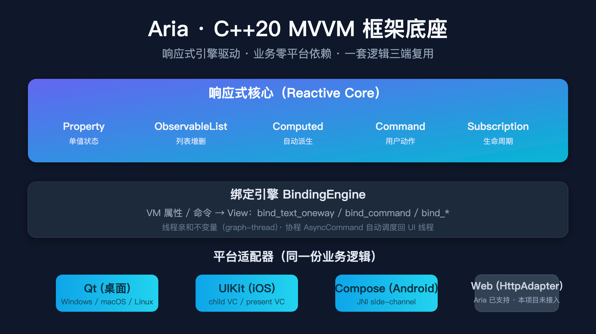
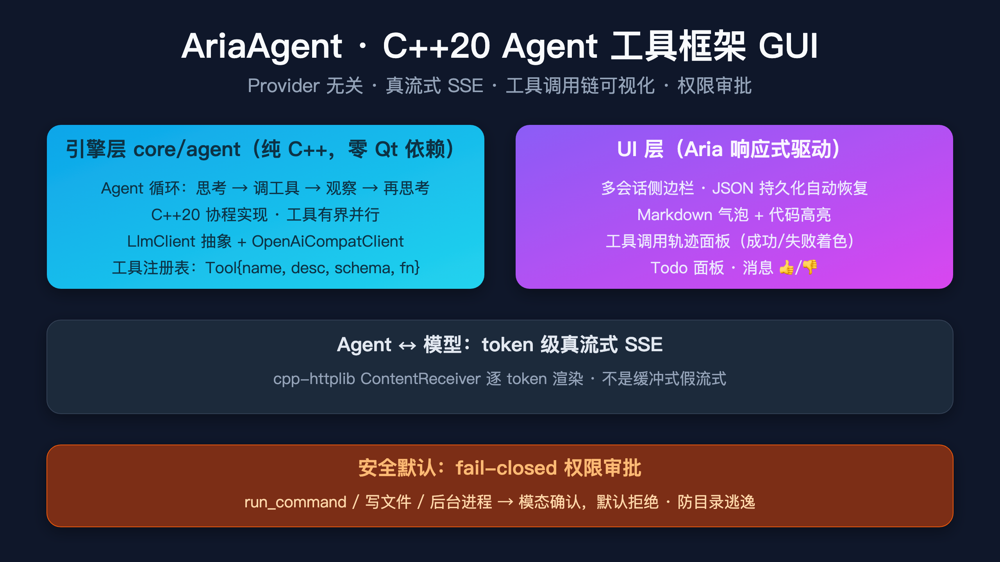

# 用 C++20 撸一个 Agent 工具框架 GUI：Provider 无关 + 真流式 SSE + 权限审批

> 一个工业级 C++20 Agent 工具框架，provider 随便换、token 级真流式、工具调用链可视化、危险操作默认拒绝。底座是自研 Aria MVVM 框架，核心纯 C++、零 Qt 依赖——意味着移动端可以直接复用。



---

## 🤔 为什么要用 C++ 写 Agent GUI

市面上 Agent GUI 一大堆：ChatGPT Next Web、Cursor、Lobe Chat、Lobe Hub……但要么 Electron（包大、内存高）、要么 Python（部署要 venv 同步）——**C++ 写 Agent GUI 几乎是空白**。

我们想要的是：

- **Provider 无关**：今天用 DeepSeek，明天换 Kimi / Qwen / OpenAI，改一行配置，零代码改动、无需重新编译
- **真流式输出**：token 级 SSE 渲染，不是先缓冲完再一次性吐出来
- **工具调用链可视化**：右侧时间线，Agent 调了哪些工具、参数是什么、结果成功失败
- **权限审批默认拒绝**（fail-closed）：执行 `rm -rf` / 写文件 / 跑命令前必须用户确认
- **单文件可执行**：用户拿到就双击跑，不挑 Python / Node 版本

> **AriaAgent**（[github.com/dqsjqian/AriaAgent](https://github.com/dqsjqian/AriaAgent)，MIT）就是为这个目标写的。

---



## 🏗 架构

```
AriaAgent/
├── core/                     # ★ 纯 C++，零 Qt 依赖（移动端可复用）
│   ├── agent/                # 引擎层：agent 循环 / llm_client / 工具
│   ├── event/                # 事件流（singleton-source-of-truth）
│   ├── tools/                # 工具注册表 + 内置 10+ 工具
│   └── session/              # 会话持久化
├── platform/qt/              # 唯一接入的桌面 UI（Aria 响应式驱动）
└── third_party/
    └── aria/                 # Aria 框架底座（submodule）
```

整个引擎层（Agent 循环 / LLM 客户端 / 工具 / 事件）都是纯 C++，Qt 只在 UI 层。

---

## ✨ 核心特性

### 🧠 Provider 无关

抽象 `LlmClient` 接口 + `OpenAiCompatClient` 实现。**所有 OpenAI 兼容端点开箱即用**——DeepSeek、OpenAI、Kimi、Qwen、GLM……换模型只改一行配置。

### ⚡ 真流式 SSE（不是缓冲式假流式）

用 `cpp-httplib 0.53.1` 的 `ContentReceiver`，**token 一到立即推给 UI**，不是等模型完整生成完再一次性解析。配合 Aria 的 `ObservableList<ChatMessage>`，UI 流式追加无卡顿。

### 🔁 Agent 循环（C++20 协程）

```cpp
Task<EventBatch> Agent::step() {
    // 1. 调 LLM
    auto reply = co_await llm_.chat(messages_, tools_);
    // 2. 若模型要调工具 → 并行执行（exclusive 屏障 + 并行池）
    if (reply.has_tool_calls()) {
        auto results = co_await run_tools_parallel(reply.tool_calls());
        // 3. 工具结果按模型原始顺序压回消息历史
        append_results(reply, results);
    }
    co_return events_;
}
```

- **有界并行**：同一轮内多个工具调用并发跑，但按模型请求的顺序提交结果
- **硬性轮数上限**：防 Agent 失控循环
- **事件流 = 唯一事实源**（仿 DeepSeek harness 架构）：UI 只订阅事件流

### 🛠 工具注册表 + 内置 10+ 工具

| 工具 | 权限 |
|---|---|
| `calculator` / `current_time` / `todo_set` | 无需审批 |
| `list_directory` / `read_file` | 无需审批 |
| `write_file` / `edit_file` | 写操作需审批 |
| `run_command` / `run_in_background` / `kill_process` | **需审批**（防 `rm -rf`） |

工具注册一次即插即用，无硬编码分支：

```cpp
Tool{"web_search", "Search the web", schema_json,
     [](const json& args) { /* ... */ return json::object(); }
};
```

参数走**轻量 JSON-Schema 校验器**（类型 / 必填 / 枚举 / 范围），错误信息带 JSON 路径。

### 📊 UI 面板

- **多会话侧边栏**：新建/切换/右键删除，JSON 持久化到 `~/.ariaagent/sessions/`，重启自动恢复
- **Markdown 气泡渲染**：消息内联 Markdown + 代码四色高亮
- **工具调用轨迹面板**（右侧）：时间线展示每个工具的成功/失败/参数/耗时
- **Todo 面板**：Agent 的 `todo_set` 列表实时投影
- **消息反馈**：右键 👍/👎，持久化
- **多轮上下文 + 自动压缩**：超 32 条自动摘要压缩，不拆散 tool-call/result 配对

### 🔐 权限审批 fail-closed

`run_command` / `write_file` / 后台进程 执行前，弹出模态确认，**默认拒绝**（用户必须明确点"批准"）。防目录逃逸校验（`write_file` 拒绝 `../`）一并在底层。

---

## 🧬 底座：Aria 框架

AriaAgent 的 UI 全部由 Aria 响应式引擎驱动：

- **状态**：VM 暴露 `Property<EventBatch>` / `ObservableList<ChatMessage>` / `Computed<is_busy>`
- **绑定**：`bind_text_oneway(vm.title, label)` 一行接到 Qt 控件
- **协程**：`AsyncCommand` 调 LLM，自动调度回 UI 线程
- **无平台泄漏**：core/agent 全是 C++，移动端只要写个壳就能复用

底座 Aria 在 [github.com/dqsjqian/Aria](https://github.com/dqsjqian/Aria)，MIT 开源。

---

## 🚀 怎么跑

```bash
# 配 LLM（任选）
export AriaAgent_LLM_BASE="https://api.deepseek.com/v1"
export AriaAgent_LLM_KEY="sk-xxx"
export AriaAgent_LLM_MODEL="deepseek-chat"

# 构建
cmake -S . -B build
cmake --build build -j

# 跑
./build/ariaagent
```

启动后会让你选模型/填 API key，然后左侧「新建会话」开始对话。

---

## 📦 仓库

- **AriaAgent**：https://github.com/dqsjqian/AriaAgent
- **底座 Aria 框架**：https://github.com/dqsjqian/Aria
- **AriaTools**（同底座的跨平台 MVVM 演示应用）：https://github.com/dqsjqian/AriaTools

⭐ **Star 一下**是给开源作者最大的鼓励！想接入更多模型 / 写新工具 / 改 UI，**PR / Issue 都欢迎**。
